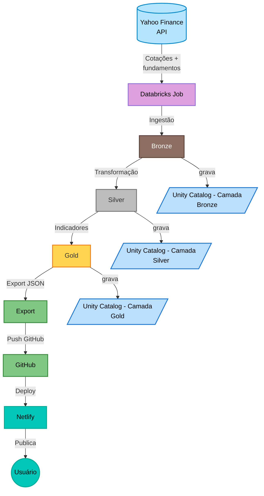

# InvestFacil — Pipeline de Dados B3 + App Web

## Visão Geral

O InvestFacil é um pipeline de dados que coleta cotações e fundamentos de ações da B3 (bolsa brasileira) diariamente, processa os dados em 3 camadas (Bronze, Silver, Gold) e exporta arquivos JSON para alimentar um aplicativo web público hospedado no Netlify.

**Qualquer pessoa pode acessar o app pelo link público — sem login, sem Databricks.**

## Funcionalidades do App Web

- Tabela com 41 ações do Ibovespa
- Filtros por ticker, setor, dividend yield, P/L, ROE
- Exportação para Excel, CSV e JSON
- Links para Status Invest, Fundamentus, Yahoo Finance e outros
- Nomes e setores em português
- Responsivo (mobile e desktop)

---

## Arquitetura do Pipeline



---

## Estrutura de Arquivos

```
InvestFacilWeb/
  index.html                    - Aplicacao web principal
  indicadores.json              - Dados de indicadores (41 acoes)
  historico.json                - Historico de cotacoes
  metadata.json                 - Metadados do pipeline
  Import-Json-InvestFacil/       - JSONs atualizados pelo pipeline
    indicadores.json
    historico.json
    metadata.json
  Informacoes_proximo_Passos.md - Checklist de testes
  _headers                      - Configuracao Netlify
  .gitignore
  README.md                     - Este arquivo
  ManualExec.md                 - Manual de execucao passo a passo
```

---

## Passo a Passo — Como Funciona

### Passo 1: Ingestão (Bronze)

O notebook `01_Bronze_Ingestao_B3` conecta à API do Yahoo Finance e coleta:
- **Cotações**: preço, abertura, máxima, mínima, volume
- **Fundamentos**: market cap, P/L, dividend yield, beta, setor

Salva em:
- `investfacil_catalog.bronze.raw_quotes` (866 registros)
- `investfacil_catalog.bronze.raw_fundamentals` (866 registros)

### Passo 2: Transformação (Silver)

O notebook `02_Silver_Transformacao` faz o parse do JSON bruto e aplica:
- **Mapeamento de nomes**: 70+ tickers traduzidos (ex: PETR4 → "Petrobras PN")
- **Tradução de setores**: "Energy" → "Petróleo e Gás", "Financial Services" → "Financeiro"
- **Limpeza**: remove duplicatas com `dropDuplicates(["ticker"])`
- **Tipagem**: converte strings para DOUBLE, LONG, TIMESTAMP

Salva em:
- `investfacil_catalog.silver.cotacoes` (6.062 registros)
- `investfacil_catalog.silver.fundamentos` (866 registros)

### Passo 3: Indicadores (Gold)

O notebook `03_Gold_Indicadores` junta cotações + fundamentos e calcula 27 indicadores:
- **Dividend Yield** (%) — retorno em dividendos
- **P/L** (Preço/Lucro) — valuation da empresa
- **ROE** (Retorno sobre Patrimônio)
- **Volatilidade** — desvio padrão dos retornos
- **Momentum 30d** — performance últimos 30 dias
- **Liquidez** — volume médio negociado
- **Beta** — sensibilidade ao mercado

Salva em:
- `investfacil_catalog.gold.indicadores_completos` (41 ações, 27 colunas)
- `investfacil_catalog.gold.cotacoes_historico`

### Passo 4: Exportação (JSON + Push GitHub)

O notebook `04_Export_JSON_S3` converte os dados Gold em 3 arquivos JSON:

| Arquivo | Tamanho | Conteúdo |
|---------|---------|----------|
| `indicadores.json` | ~19 KB | 41 ações com todos os indicadores |
| `historico.json` | ~2 bytes | Histórico de cotações agrupado por ticker |
| `metadata.json` | ~0.6 KB | Metadados do pipeline (data, fonte, total) |

Os JSONs são gravados no workspace e enviados via GitHub REST API para a pasta `Import-Json-InvestFacil/`.

---

## Estrutura dos Arquivos JSON

### indicadores.json

```json
[
  {
    "ticker": "PETR4",
    "nome_curto": "Petrobras PN",
    "nome_completo": "Petróleo Brasileiro S.A. - Petrobras",
    "setor": "Petróleo e Gás",
    "preco_atual": 49.0,
    "dividend_yield": 8.85,
    "preco_lucro_pl": 4.85,
    "volatilidade": null,
    "momentum_30d": null,
    "beta": -0.213
  }
]
```

### metadata.json

```json
{
  "projeto": "InvestFacil",
  "versao": "1.0",
  "ultima_atualizacao": "2026-10-07 15:30:00 BRT",
  "fonte_dados": "brapi.dev",
  "total_acoes": 41,
  "indicadores_disponiveis": [
    "dividend_yield",
    "preco_lucro_pl",
    "retorno_patrimonio_roe",
    "volatilidade",
    "momentum_30d",
    "volume_medio"
  ]
}
```

---

## Como Executar Localmente

1. Baixar os arquivos: `index.html`, `indicadores.json`, `metadata.json`, `historico.json`
2. Colocar todos na mesma pasta
3. Abrir `index.html` no navegador

## Deploy no Netlify

### Via Git (Recomendado)
1. Conectar o repo `flrmedeiros78/InvestFacilWeb` no Netlify
2. Build: nenhum (site estático)
3. Publish directory: raiz do repo
4. Deploy automático a cada push no GitHub

### Via Drag & Drop
1. Acessar: https://app.netlify.com/drop
2. Arrastar a pasta com os arquivos
3. Site no ar em segundos

---

## Repositórios

| Repositório | Função |
|-------------|--------|
| [flrmedeiros78/Databricks](https://github.com/flrmedeiros78/Databricks) | Pipeline de dados (notebooks, job) |
| [flrmedeiros78/InvestFacilWeb](https://github.com/flrmedeiros78/InvestFacilWeb) | App web + JSONs exportados (este repositório) |

## Job no Databricks

| Item | Valor |
|------|-------|
| **Nome** | InvestFacil_Pipeline_Diario |
| **Job ID** | 679490622792902 |
| **Schedule** | Diariamente às 19h (America/Sao_Paulo) |
| **Duração** | ~3 minutos |
| **Compute** | Serverless |

## Catálogo Unity (Databricks)

| Camada | Tabela | Registros |
|--------|--------|-----------|
| Bronze | `investfacil_catalog.bronze.raw_quotes` | 866 |
| Bronze | `investfacil_catalog.bronze.raw_fundamentals` | 866 |
| Silver | `investfacil_catalog.silver.cotacoes` | 6.062 |
| Silver | `investfacil_catalog.silver.fundamentos` | 866 |
| Gold | `investfacil_catalog.gold.indicadores_completos` | 41 |
| Gold | `investfacil_catalog.gold.cotacoes_historico` | 0 |

## Tempos de Execução

| Tarefa | Duração |
|--------|--------|
| Bronze (Ingestao) | 107s |
| Silver (Transformacao) | 42s |
| Gold (Indicadores) | 26s |
| Export (JSON + Push) | 17s |
| **Total** | **~192s** |

---

## Tecnologias

- **Databricks** — processamento de dados (PySpark, Serverless)
- **Unity Catalog** — governança e armazenamento
- **Yahoo Finance API** — fonte de dados da B3
- **GitHub REST API** — push automático dos JSONs
- **Netlify** — hospedagem gratuita do app web
- **HTML/CSS/JavaScript** — interface do app

---

## Secrets Necessarios

- Scope: `investfacil`
- Key: `github_token` (GitHub PAT com permissão Contents Read and Write)

## Autor

Desenvolvido por fabiolrm78@gmail.com
